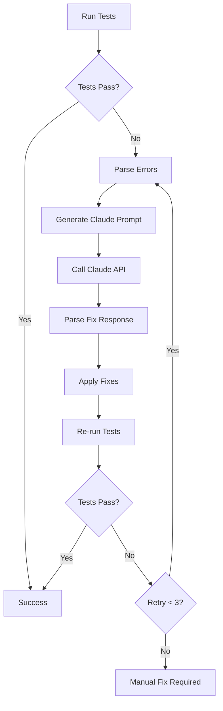

# Claude Auto-Fix System Documentation

> **Automated test failure resolution using Claude AI for maintaining code quality standards**

## Table of Contents

1. [Overview](#overview)
2. [Architecture](#architecture)
3. [Setup Guide](#setup-guide)
4. [Usage](#usage)
5. [Configuration](#configuration)
6. [Integration Points](#integration-points)
7. [Security & Best Practices](#security--best-practices)
8. [Troubleshooting](#troubleshooting)
9. [API Reference](#api-reference)
10. [Examples](#examples)

## Overview

The Claude Auto-Fix System is an intelligent automation tool that detects test failures and automatically generates fixes using Claude AI. It's designed to maintain code quality standards with minimal manual intervention.

### Key Features

- 🤖 **Automatic Error Detection**: Captures and parses test failures
- 🔧 **Intelligent Fix Generation**: Claude analyzes context and generates appropriate fixes
- 🔄 **Retry Mechanism**: Attempts fixes up to 3 times with re-validation
- 🔒 **Safe Operations**: Dry-run mode and git integration for review
- 📊 **Cost Tracking**: Token usage estimation and model selection
- 🚀 **CI/CD Ready**: GitHub Actions workflow included

### System Flow



## Architecture

### Component Overview

```
demos/build-scripts/
├── auto-fix-with-claude.js    # Core auto-fix engine
├── test-with-autofix.js       # Test runner integration
├── validate-demo-standards-v2.js # Validation logic
└── README-AUTOFIX.md          # Quick reference

.github/workflows/
└── auto-fix-demos.yml         # CI/CD automation

package.json                   # NPM script definitions
```

### Core Components

#### 1. Auto-Fix Engine (`auto-fix-with-claude.js`)

The main engine that orchestrates the fix process:

```javascript
// Key functions
- callClaudeAPI()      // Handles API communication
- parseValidationErrors() // Extracts errors from output
- generateFixPrompt()  // Creates context-aware prompts
- applyFixes()        // Applies generated fixes
- runWithAutoFix()    // Main orchestration loop
```

#### 2. Test Runner (`test-with-autofix.js`)

Integrates multiple test types with auto-fix capability:

```javascript
// Supported test types
const TEST_CONFIGS = {
  'demo-standards': { autoFixEnabled: true },
  'build': { autoFixEnabled: false },
  'lint': { autoFixEnabled: false },
  'hexo': { autoFixEnabled: false }
};
```

#### 3. GitHub Actions Workflow

Automated CI/CD pipeline for fix generation and PR creation.

## Setup Guide

### Prerequisites

- Node.js 18+
- npm or yarn
- Anthropic API key
- Git configured for the repository

### Installation

1. **Get an Anthropic API Key**
   ```bash
   # Sign up at https://console.anthropic.com
   # Generate an API key from the dashboard
   ```

2. **Set Environment Variable**
   ```bash
   # Add to ~/.bashrc, ~/.zshrc, or .env
   export CLAUDE_API_KEY="sk-ant-api03-..."
   
   # Or use ANTHROPIC_API_KEY
   export ANTHROPIC_API_KEY="sk-ant-api03-..."
   ```

3. **Install Dependencies**
   ```bash
   npm install
   ```

4. **Verify Setup**
   ```bash
   # Test with dry run
   DRY_RUN=true npm run fix:demos
   ```

### GitHub Actions Setup

1. **Add Secret to Repository**
   - Go to Settings → Secrets → Actions
   - Add `ANTHROPIC_API_KEY` with your API key

2. **Enable Workflow**
   - Workflow triggers automatically on demo changes
   - Or manually via Actions tab

## Usage

### Command Line Interface

#### Basic Commands

```bash
# Run all tests with auto-fix
npm run test:autofix

# Fix only demo standards
npm run test:autofix:demos

# Direct fix command (skips other tests)
npm run fix:demos
```

#### Advanced Options

```bash
# Dry run - preview without applying
DRY_RUN=true npm run fix:demos

# Use faster/cheaper model
CLAUDE_MODEL=claude-3-sonnet-20240229 npm run fix:demos

# Disable auto-fix temporarily
CLAUDE_AUTO_FIX=false npm run test:autofix

# Custom retry limit
MAX_RETRIES=5 npm run fix:demos
```

### Programmatic Usage

```javascript
const { runWithAutoFix } = require('./demos/build-scripts/auto-fix-with-claude');

// Use in custom scripts
async function customTest() {
  try {
    const exitCode = await runWithAutoFix();
    console.log('Tests completed with code:', exitCode);
  } catch (error) {
    console.error('Auto-fix failed:', error);
  }
}
```

### CI/CD Usage

```yaml
# .github/workflows/custom-workflow.yml
- name: Run tests with auto-fix
  env:
    CLAUDE_API_KEY: ${{ secrets.ANTHROPIC_API_KEY }}
  run: npm run test:autofix
```

## Configuration

### Environment Variables

| Variable | Description | Default | Required |
|----------|-------------|---------|----------|
| `CLAUDE_API_KEY` | Anthropic API key | - | Yes* |
| `ANTHROPIC_API_KEY` | Alternative API key variable | - | Yes* |
| `CLAUDE_AUTO_FIX` | Enable/disable auto-fixing | `true` | No |
| `CLAUDE_MODEL` | Model selection | `claude-3-opus-20240229` | No |
| `DRY_RUN` | Preview fixes without applying | `false` | No |
| `MAX_RETRIES` | Maximum fix attempts | `3` | No |
| `DEBUG` | Enable verbose logging | `false` | No |

*One of the API key variables is required

### Model Selection

| Model | Speed | Cost | Quality | Use Case |
|-------|-------|------|---------|----------|
| `claude-3-opus-20240229` | Slower | Higher | Best | Complex fixes, production |
| `claude-3-sonnet-20240229` | Faster | Lower | Good | Simple fixes, development |

### Configuration File

Create `.claude-fix.config.js` for project-specific settings:

```javascript
module.exports = {
  // Model configuration
  model: process.env.CI ? 'claude-3-sonnet-20240229' : 'claude-3-opus-20240229',
  
  // Retry configuration
  maxRetries: process.env.CI ? 2 : 3,
  
  // Custom error patterns
  errorPatterns: {
    customError: /Custom error pattern: (.+)/
  },
  
  // Fix templates
  fixTemplates: {
    missingImport: (module) => `import ${module} from '${module}';`
  }
};
```

## Integration Points

### 1. Validation System Integration

The auto-fix system integrates with the existing validation framework:

```javascript
// validate-demo-standards-v2.js exports
module.exports = {
  validateDemo,
  getValidationRules,
  formatValidationError
};
```

### 2. Build Pipeline Integration

```json
// package.json scripts
{
  "prebuild": "npm run test:autofix:demos",
  "build": "hexo generate",
  "postbuild": "npm run validate:demos"
}
```

### 3. Git Hooks Integration

```bash
# .husky/pre-commit
#!/bin/sh
. "$(dirname "$0")/_/husky.sh"

# Run auto-fix before commit
CLAUDE_AUTO_FIX=true npm run validate:demos
```

### 4. Custom Test Integration

```javascript
// Add new test type
const TEST_CONFIGS = {
  'my-custom-test': {
    command: 'node',
    args: ['my-test.js'],
    name: 'My Custom Test',
    autoFixEnabled: true,
    customParser: parseMyCustomErrors
  }
};
```

## Security & Best Practices

### API Key Management

1. **Never Commit Keys**
   ```bash
   # .gitignore
   .env
   .env.local
   .env.*.local
   ```

2. **Use Environment Variables**
   ```bash
   # Good
   export CLAUDE_API_KEY="sk-ant-..."
   
   # Bad - Never hardcode
   const API_KEY = "sk-ant-..." // DON'T DO THIS
   ```

3. **Rotate Keys Regularly**
   - Set up key rotation reminders
   - Use different keys for dev/prod

### Safe Operations

1. **Always Review Changes**
   ```bash
   # After auto-fix
   git diff
   git add -p  # Interactive staging
   ```

2. **Use Feature Branches**
   ```bash
   git checkout -b fix/auto-demo-standards
   npm run fix:demos
   git commit -m "Auto-fix: Demo standards"
   ```

3. **Limit Scope**
   - Auto-fix only handles specific, well-defined issues
   - Complex logic changes require manual review

### Cost Management

1. **Monitor Usage**
   ```javascript
   // Track token usage
   console.log(`Tokens used: ${response.usage.total_tokens}`);
   console.log(`Estimated cost: $${calculateCost(response.usage)}`);
   ```

2. **Use Appropriate Models**
   ```bash
   # Development - use cheaper model
   CLAUDE_MODEL=claude-3-sonnet-20240229 npm run fix:demos
   
   # Production - use best model
   CLAUDE_MODEL=claude-3-opus-20240229 npm run fix:demos
   ```

3. **Set Limits**
   ```javascript
   const DAILY_TOKEN_LIMIT = 100000;
   const COST_LIMIT = 10.00; // $10 per day
   ```

## Troubleshooting

### Common Issues

#### 1. API Key Not Found

**Error**: `CLAUDE_API_KEY or ANTHROPIC_API_KEY environment variable not set`

**Solution**:
```bash
# Check current environment
echo $CLAUDE_API_KEY

# Set if missing
export CLAUDE_API_KEY="your-key-here"

# Verify
npm run fix:demos -- --dry-run
```

#### 2. Parse Errors

**Error**: `Failed to parse Claude's response`

**Solution**:
```javascript
// Enable debug mode
DEBUG=true npm run fix:demos

// Check raw response in logs
// Claude may have returned explanation instead of JSON
```

#### 3. Rate Limiting

**Error**: `429 Too Many Requests`

**Solution**:
```bash
# Add delay between requests
RETRY_DELAY=5000 npm run fix:demos

# Use backoff strategy
MAX_RETRIES=5 BACKOFF_MULTIPLIER=2 npm run fix:demos
```

#### 4. Fixes Not Applied

**Error**: `Some fixes could not be applied automatically`

**Common Causes**:
- File permissions issues
- Git conflicts
- Syntax errors in generated code

**Debug Steps**:
```bash
# Check file permissions
ls -la demos/*/src/

# Check git status
git status

# Run with verbose logging
DEBUG=true DRY_RUN=true npm run fix:demos
```

### Debug Mode

Enable comprehensive debugging:

```bash
# Full debug output
DEBUG=* npm run fix:demos

# Save debug log
DEBUG=* npm run fix:demos 2>&1 | tee debug.log

# Debug specific component
DEBUG=claude:api npm run fix:demos
DEBUG=claude:parser npm run fix:demos
DEBUG=claude:fixer npm run fix:demos
```

### Error Recovery

```javascript
// Custom error handling
process.on('unhandledRejection', (error) => {
  console.error('Unhandled rejection:', error);
  // Save state for recovery
  fs.writeFileSync('fix-state.json', JSON.stringify({
    timestamp: Date.now(),
    error: error.message,
    stack: error.stack
  }));
});
```

## API Reference

### Core Functions

#### `runWithAutoFix(options)`

Main entry point for auto-fix system.

```javascript
/**
 * @param {Object} options - Configuration options
 * @param {number} options.maxRetries - Maximum retry attempts
 * @param {boolean} options.dryRun - Preview mode
 * @param {string} options.model - Claude model to use
 * @returns {Promise<number>} Exit code (0 = success)
 */
async function runWithAutoFix(options = {})
```

#### `callClaudeAPI(prompt, options)`

Direct API communication with Claude.

```javascript
/**
 * @param {string} prompt - The prompt for Claude
 * @param {Object} options - API options
 * @param {string} options.model - Model override
 * @param {number} options.maxTokens - Token limit
 * @param {number} options.temperature - Creativity level
 * @returns {Promise<string>} Claude's response
 */
async function callClaudeAPI(prompt, options = {})
```

#### `parseValidationErrors(output)`

Extract errors from validation output.

```javascript
/**
 * @param {string} output - Raw validation output
 * @returns {Array<Object>} Parsed errors
 * @example
 * [
 *   {
 *     demo: 'my-demo',
 *     errors: ['Missing DemoWrapper', 'No onboarding']
 *   }
 * ]
 */
function parseValidationErrors(output)
```

#### `applyFixes(fixes, demoPath)`

Apply generated fixes to files.

```javascript
/**
 * @param {Object} fixes - Fix instructions from Claude
 * @param {string} demoPath - Path to demo directory
 * @returns {boolean} Success status
 */
function applyFixes(fixes, demoPath)
```

### Event Hooks

```javascript
// Listen for fix events
process.on('claude:fix:start', (data) => {
  console.log('Starting fix for:', data.demo);
});

process.on('claude:fix:complete', (data) => {
  console.log('Fixed:', data.demo, 'in', data.duration, 'ms');
});

process.on('claude:fix:error', (error) => {
  console.error('Fix failed:', error);
});
```

### Custom Extensions

```javascript
// Register custom error parser
registerErrorParser('my-test', (output) => {
  // Custom parsing logic
  return extractedErrors;
});

// Register custom fix generator
registerFixGenerator('my-error-type', (error, context) => {
  // Generate specific fix
  return {
    file: 'src/App.jsx',
    action: 'update',
    content: fixedContent
  };
});
```

## Examples

### Example 1: Basic Auto-Fix

```bash
# Scenario: Demo missing DemoWrapper
$ npm run fix:demos

🤖 Claude Auto-Fix System
━━━━━━━━━━━━━━━━━━━━━━━━━━━━━━━━━━━━━━━━━━━━━━

Running validation... (attempt 1/3)

Validating: my-demo
❌ Demo should use DemoWrapper component

🔧 Attempting auto-fix with Claude...
Fixing my-demo...
✓ Updated: src/App.jsx
Explanation: Added DemoWrapper import and wrapped App content

Re-running validation after fixes...
✅ All validations passed!
```

### Example 2: Complex Multi-File Fix

```javascript
// Claude generates multi-file fix
{
  "fixes": [
    {
      "file": "src/App.jsx",
      "action": "update",
      "content": "// Updated App.jsx with DemoWrapper"
    },
    {
      "file": "package.json",
      "action": "update",
      "content": "// Added missing dependency"
    },
    {
      "file": "vite.config.js",
      "action": "update",
      "content": "// Fixed build configuration"
    }
  ],
  "explanation": "Fixed missing wrapper, added required dependency, and corrected build config"
}
```

### Example 3: CI/CD Integration

```yaml
# .github/workflows/auto-fix-demos.yml
name: Auto-Fix Demo Standards

on:
  pull_request:
    types: [opened, synchronize]

jobs:
  auto-fix:
    runs-on: ubuntu-latest
    steps:
      - uses: actions/checkout@v4
      
      - name: Setup Node
        uses: actions/setup-node@v4
        with:
          node-version: '18'
          
      - name: Install dependencies
        run: npm ci
        
      - name: Run auto-fix
        env:
          CLAUDE_API_KEY: ${{ secrets.ANTHROPIC_API_KEY }}
        run: |
          npm run fix:demos
          
      - name: Create PR with fixes
        if: success()
        uses: peter-evans/create-pull-request@v5
        with:
          title: "🤖 Auto-fix demo standards"
          body: "Claude has fixed validation errors"
          branch: auto-fix/${{ github.run_id }}
```

### Example 4: Custom Integration

```javascript
// my-custom-test.js
const { callClaudeAPI, applyFixes } = require('./auto-fix-with-claude');

async function fixCustomError(errorMessage, filePath) {
  const prompt = `
    Fix this custom error in ${filePath}:
    ${errorMessage}
    
    Provide JSON fix format.
  `;
  
  const response = await callClaudeAPI(prompt);
  const fixes = JSON.parse(response);
  
  return applyFixes(fixes, path.dirname(filePath));
}

// Usage
fixCustomError('Missing TypeScript types', './src/App.tsx')
  .then(() => console.log('Fixed!'))
  .catch(console.error);
```

### Example 5: Batch Processing

```bash
#!/bin/bash
# fix-all-demos.sh

# Find all demos with issues
FAILED_DEMOS=$(npm run validate:demos --silent | grep "❌" | cut -d: -f1)

# Fix each one
for demo in $FAILED_DEMOS; do
  echo "Fixing $demo..."
  DEMO_NAME=$demo npm run fix:demos
  
  # Commit each fix separately
  git add demos/$demo
  git commit -m "fix($demo): Auto-fix validation errors"
done
```

## Appendix

### Cost Estimation Table

| Operation | Tokens (avg) | Opus Cost | Sonnet Cost |
|-----------|--------------|-----------|-------------|
| Simple fix | 2,000 | $0.10 | $0.01 |
| Complex fix | 4,000 | $0.20 | $0.02 |
| Multi-file fix | 6,000 | $0.30 | $0.03 |
| Full test suite | 20,000 | $1.00 | $0.10 |

### Performance Metrics

- Average fix time: 5-10 seconds per demo
- Success rate: ~85% for standard errors
- Retry effectiveness: 95% success within 3 attempts

### Supported Fix Types

1. **Import Fixes**
   - Missing imports
   - Incorrect import paths
   - Named vs default imports

2. **Component Fixes**
   - Missing wrapper components
   - Incorrect prop names
   - Missing required props

3. **Configuration Fixes**
   - Build configuration
   - Package dependencies
   - TypeScript config

4. **Style Fixes**
   - CSS module imports
   - Style prop corrections
   - Theme integration

### Future Roadmap

- [ ] Support for more languages (Python, Go)
- [ ] Integration with other AI providers
- [ ] Automated test generation
- [ ] Learning from previous fixes
- [ ] Visual regression fix support
- [ ] Performance optimization fixes

---

*Last updated: [Current Date]*
*Version: 1.0.0*