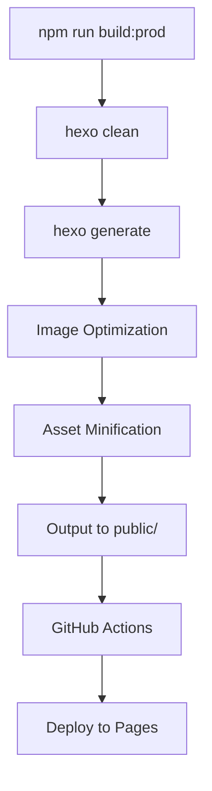

# Architecture Documentation

## Table of Contents

1. [Overview](#overview)
2. [System Architecture](#system-architecture)
3. [Technology Stack](#technology-stack)
4. [Component Architecture](#component-architecture)
5. [Data Flow](#data-flow)
6. [Build Pipeline](#build-pipeline)
7. [Deployment Architecture](#deployment-architecture)
8. [Security Architecture](#security-architecture)
9. [Performance Architecture](#performance-architecture)
10. [Technical Decisions](#technical-decisions)

## Overview

This document provides a comprehensive technical overview of the thomas.design blog architecture. The site is built as a static site generator (SSG) using Hexo, with a custom theme and advanced optimization pipeline.

### Key Architectural Principles

- **Static First**: All content is pre-rendered at build time
- **Performance Optimized**: Aggressive optimization of all assets
- **Progressive Enhancement**: Core functionality works without JavaScript
- **Modular Design**: Component-based architecture for maintainability
- **CI/CD Automated**: Fully automated build and deployment pipeline

## System Architecture

```
┌─────────────────────────────────────────────────────────────┐
│                        Source Code                           │
│  ┌─────────────┐  ┌──────────────┐  ┌──────────────────┐  │
│  │   Content    │  │    Theme     │  │   Build Tools    │  │
│  │  (Markdown)  │  │ (san-diego)  │  │  (Scripts/Tools) │  │
│  └──────┬──────┘  └──────┬───────┘  └────────┬─────────┘  │
│         │                 │                    │             │
│         └─────────────────┴────────────────────┘            │
│                           │                                  │
│                    ┌──────▼───────┐                         │
│                    │    Hexo      │                         │
│                    │   (7.3.0)    │                         │
│                    └──────┬───────┘                         │
└───────────────────────────┼─────────────────────────────────┘
                            │
                    ┌───────▼────────┐
                    │  Build Process │
                    │  ┌──────────┐  │
                    │  │  Sharp.js │  │
                    │  │   Image   │  │
                    │  │ Optimize  │  │
                    │  └──────────┘  │
                    │  ┌──────────┐  │
                    │  │   Hexo    │  │
                    │  │  Minify   │  │
                    │  └──────────┘  │
                    └───────┬────────┘
                            │
                    ┌───────▼────────┐
                    │  GitHub Actions│
                    │    CI/CD       │
                    └───────┬────────┘
                            │
                    ┌───────▼────────┐
                    │  GitHub Pages  │
                    │  (Production)  │
                    └────────────────┘
```

## Technology Stack

### Core Framework
- **Hexo 7.3.0**: Static site generator
- **Node.js 18+**: Runtime environment
- **npm**: Package management

### Frontend Technologies
- **EJS**: Templating engine
- **SCSS**: CSS preprocessor with modular architecture
- **JavaScript (ES6+)**: Modern JavaScript with modules
- **Web Components**: Custom elements for rich interactions

### Build Tools
- **Sharp.js**: Image optimization
- **hexo-minify**: Asset minification
- **Sass**: SCSS compilation
- **GitHub Actions**: CI/CD automation

### Development Tools
- **Stylelint**: SCSS linting
- **ESLint**: JavaScript linting (planned)
- **Git**: Version control

## Component Architecture

### Theme Structure (san-diego)

```
themes/san-diego/
├── layout/                 # EJS Templates
│   ├── _partial/          # Reusable components
│   │   ├── head.ejs       # Meta tags, resources
│   │   ├── nav.ejs        # Navigation
│   │   ├── footer.ejs     # Footer
│   │   └── ...            # Other partials
│   ├── index.ejs          # Homepage
│   ├── post.ejs           # Blog post
│   ├── project.ejs        # Portfolio project
│   └── project_gallery.ejs # Gallery layout
├── source/
│   ├── js/                # JavaScript modules
│   │   ├── components/    # UI components
│   │   ├── utils/         # Utilities
│   │   └── main.js        # Entry point
│   └── styles/            # SCSS files
│       ├── _variables.scss # Design tokens
│       ├── atoms/         # Basic elements
│       ├── molecules/     # Component groups
│       └── organisms/     # Complex components
└── scripts/               # Build processors
```

### JavaScript Architecture

```javascript
// Module Structure
main.js
├── utils/
│   ├── animations.js      // Animation utilities
│   ├── sound-effects.js   // Audio feedback
│   └── color-scheme.js    // Theme switching
├── components/
│   ├── carousel.js        // Media galleries
│   ├── adaptive-video.js  // Video handling
│   └── interactive-quote.js // Rich text
└── core/
    └── navigation.js      // Site navigation
```

### SCSS Architecture

```scss
// Token-based design system
styles/
├── _variables.scss        // Design tokens
├── _typography.scss       // Type system
├── theme-modes/          // Dark/light themes
│   ├── light-mode.scss
│   └── dark-mode.scss
├── atoms/                // Basic elements
├── molecules/            // Components
└── organisms/            // Layouts
```

## Data Flow

### Content Pipeline

```
1. Author writes Markdown
   └── source/_posts/my-post.md

2. Hexo processes content
   ├── Parse frontmatter
   ├── Convert Markdown to HTML
   └── Apply templates

3. Theme renders layout
   ├── Load EJS template
   ├── Inject content
   └── Generate HTML

4. Optimization pipeline
   ├── Optimize images (Sharp.js)
   ├── Minify HTML/CSS/JS
   └── Generate static files

5. Deploy to production
   └── public/ → GitHub Pages
```

### Build Process Flow



## Build Pipeline

### Local Development
```bash
npm run server
# → Hexo server
# → Live reload
# → No optimization
```

### Production Build
```bash
npm run build:prod
# → Clean previous build
# → Generate site
# → Optimize images
# → Minify assets
# → Output to public/
```

### Image Optimization Pipeline
- **Input**: JPG/PNG in source/
- **Process**: 
  - Resize if > 1920x1080
  - Compress to 85% quality
  - Progressive encoding
  - Skip if < 10KB
- **Output**: Optimized images

### Asset Minification
- **HTML**: Remove comments, collapse whitespace
- **CSS**: Remove unused rules, minify
- **JS**: Uglify, remove sourcemaps
- **Images**: Additional compression

## Deployment Architecture

### GitHub Actions Workflow

```yaml
on:
  push:
    branches: [main]

jobs:
  build-and-deploy:
    steps:
      1. Checkout code
      2. Setup Node.js 18
      3. Install dependencies
      4. Optimize images
      5. Build production
      6. Deploy to Pages
```

### Deployment Targets
- **Production**: thomas.design (GitHub Pages)
- **Preview**: Pull request previews
- **Local**: http://localhost:4000

## Security Architecture

### Content Security
- Static site (no server-side code)
- No user-generated content
- No database or API endpoints

### Client Security
- CSP headers via `_headers`
- External links: `rel="noopener noreferrer"`
- HTTPS enforced by GitHub Pages

### Build Security
- GitHub Actions with minimal permissions
- No secrets in repository
- Dependency scanning

## Performance Architecture

### Optimization Layers

1. **Build Time**
   - Image compression (Sharp.js)
   - Asset minification
   - Dead code elimination

2. **Network**
   - HTTP/2 (GitHub Pages)
   - Brotli compression
   - Cache headers

3. **Runtime**
   - Lazy loading images
   - Progressive enhancement
   - Minimal JavaScript

### Performance Metrics
- **First Contentful Paint**: < 1s
- **Time to Interactive**: < 2s
- **Lighthouse Score**: 90+
- **Page Weight**: Variable (see tech debt)

## Technical Decisions

### Why Hexo?
- **Pros**: Fast builds, plugin ecosystem, simple
- **Cons**: Aging ecosystem, limited features
- **Alternative considered**: Gatsby, Next.js

### Why Custom Theme?
- **Pros**: Full control, optimized for content
- **Cons**: Maintenance burden
- **Decision**: Worth it for unique design

### Why GitHub Pages?
- **Pros**: Free, reliable, integrated
- **Cons**: Limited features, no server-side
- **Decision**: Perfect for static sites

### Future Considerations
1. **Migration to modern SSG** (Astro, Next.js)
2. **Edge functions** for dynamic features
3. **Component library** extraction
4. **Automated testing** implementation

## Maintenance Notes

### Regular Tasks
- Update dependencies monthly
- Monitor build times
- Check image optimization
- Review error logs

### Upgrade Path
1. Keep Hexo updated
2. Monitor plugin compatibility
3. Plan theme modernization
4. Consider framework migration

### Known Limitations
- See [docs/TECH_DEBT.md](./docs/TECH_DEBT.md)
- HTML size issues with inline posts
- Sass deprecation warnings
- Module system inconsistency