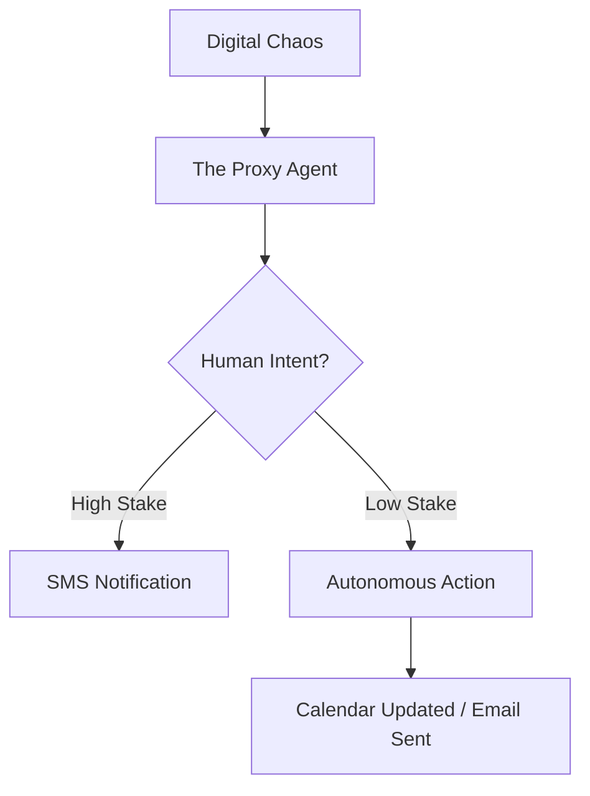

In my last post, [Agent Swarm Architecture](/2026/01/20/Agent-Swarm-Architecture/), I talked about how the industry is converging on a specific "Planner/Worker/Judge" pattern for multi-agent systems. It’s a structural evolution born of necessity. 

But there’s a second convergence happening—not in how agents are built, but in how we interact with them. 

Eight months ago, while working on [Proxy AI Agent](https://github.com/Triglavis/proxy-ai-agent/) (which we called Tempo), I made a prediction: **The "UI" for the most successful AI agents will eventually disappear.** 

## From Chaos to Proxy

When we built Tempo, we designed a toggle that stayed stuck in my head: **Chaos Mode vs. Proxy Mode.**

*   **Chaos Mode** is the world we live in now. It’s a dashboard full of notifications, calendar invites, and unread emails. You are the manual router, the one who has to click "Accept" or "Reply." Even with "AI features," you’re still the one looking at the screen.
*   **Proxy Mode** is the transition to an invisible representative. The agent doesn't give you a better dashboard to manage the chaos; it stands in front of the chaos as your proxy. It defends your calendar, negotiates your time, and only surfaces the decisions that actually require your unique human judgment.

The prediction was simple: we don’t want better tools; we want better proxies. We want to stop managing coordination and start leading.

## The Clawdbot Signal

I’m seeing this prediction play out in real-time with the sudden popularity of [Clawdbot](https://clawd.bot). 

On the surface, Clawdbot is just a clean interface for Claude. But why is it winning? Because it acts as a **proxy for the model itself.** It strips away the friction, the heavy UI, and the "Chaos" of the standard web interface. It’s a specialized representative that gets you closer to the raw intelligence with zero overhead.

When you combine the **Swarm Architecture** (how agents work together) with the **Proxy Paradigm** (how agents work for us), you get the endgame: **Invisible Operations.**

## The Invisible Operations Core

In the original technical roadmap for the Proxy Agent, we focused on what we called the "Invisible Operations Core." It was email-first and SMS-first. No new apps to download. No new dashboards to check.

The goal wasn't to build a better "Chief of Staff" app; it was to build a digital representative that could negotiate like you would. 

## The Next Convergence

If Cursor and MeshSeeks proved that agent *logic* is converging on a hierarchy, then projects like Tempo and Clawdbot prove that agent *interaction* is converging on the proxy.

We are moving from a world of "AI as a tool" to "AI as a representative." 

The next big challenge isn't just making agents smarter; it's building the protocols that allow my proxy to talk to your proxy. When our agents can negotiate a meeting time without either of us ever opening an email, we’ll know the Proxy Era has truly arrived.

---

*Proxy AI Agent is open source at [github.com/Triglavis/proxy-ai-agent](https://github.com/Triglavis/proxy-ai-agent/). If you're building in the proxy space, I'd love to chat.*
